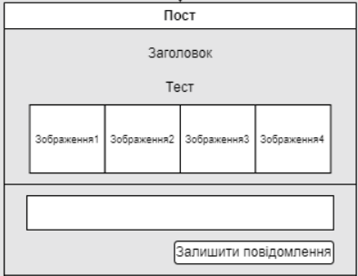
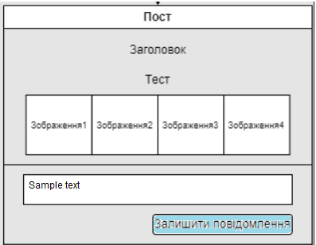
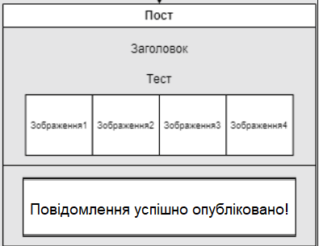

| NFR iD | TC id | Опис кроків тестового сценарію | Опис очікуваних результатів |
| ----- | ----- | ------------------------------ | --------------------------- |
| NFR2.1 | TC1.6 | Початкові умови: відсутні.   Кроки сценарію: відсутні. | Екрана форма:    |
| NFR2.1 | TC1.7 | Початкові умови: успішно пройдено TC1.6.   Кроки сценарію:   1) В поле «Text» внесено значення "Sample Text"   | Екрана форма:    |
| NFR2.1 | TC1.8 | Початкові умови: не успішно пройдено TC1.7.   Кроки сценарію:   1) Натиснуто кнопку «Завершити» | Екрана форма:    |
